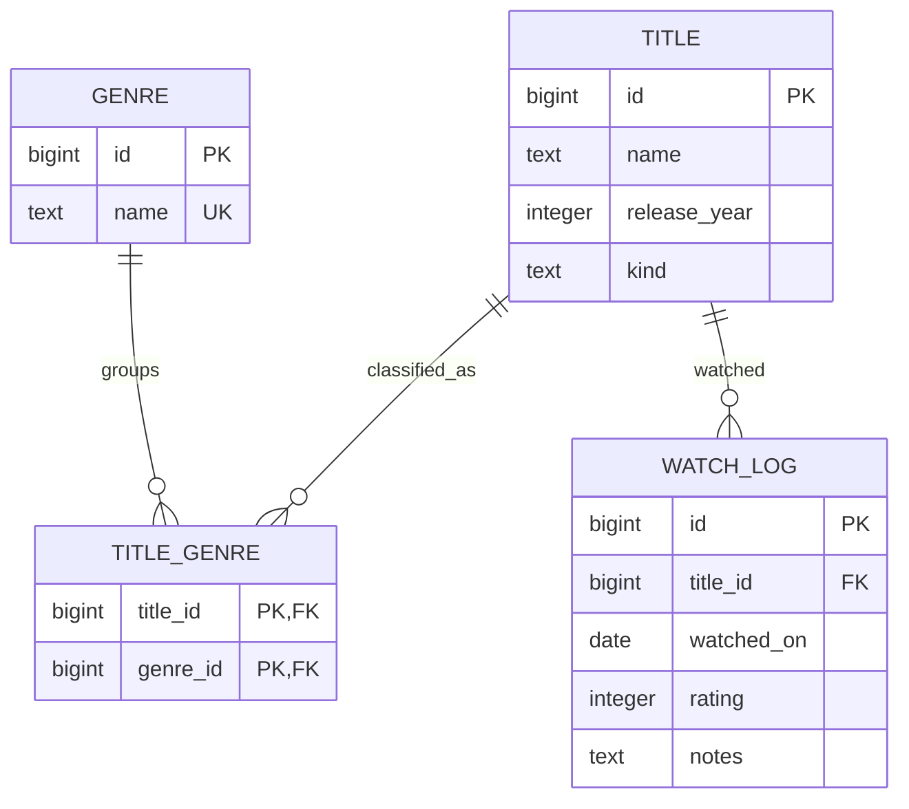

# Media ERD

```mermaid
erDiagram
    TITLE ||--o{ TITLE_GENRE : classified_as
    GENRE ||--o{ TITLE_GENRE : groups
    TITLE ||--o{ WATCH_LOG : watched
    TITLE {
        bigint id PK
        text name
        integer release_year
        text kind
    }
    GENRE {
        bigint id PK
        text name UK
    }
    TITLE_GENRE {
        bigint title_id PK,FK
        bigint genre_id PK,FK
    }
    WATCH_LOG {
        bigint id PK
        bigint title_id FK
        date watched_on
        integer rating
        text notes
    }
```

Template for extensions: add entities, keys, and cardinalities here, then check them against the actual DDL. Explain optional fields and deletion rules in design.md.
