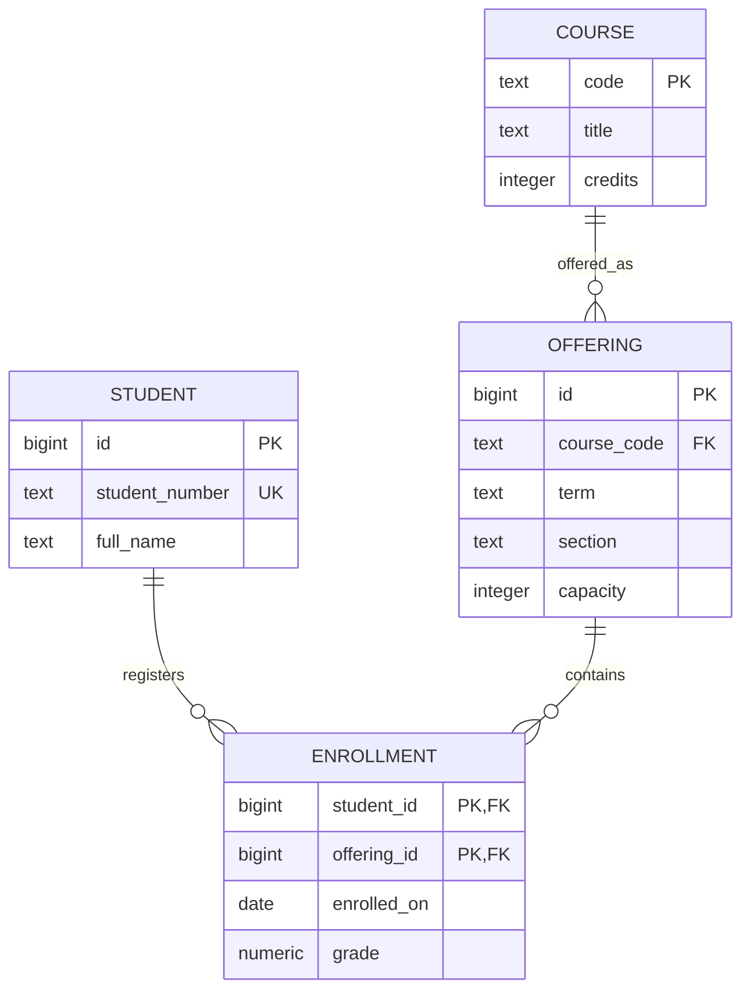

# Enrollment ERD

```mermaid
erDiagram
    COURSE ||--o{ OFFERING : offered_as
    STUDENT ||--o{ ENROLLMENT : registers
    OFFERING ||--o{ ENROLLMENT : contains
    STUDENT {
        bigint id PK
        text student_number UK
        text full_name
    }
    COURSE {
        text code PK
        text title
        integer credits
    }
    OFFERING {
        bigint id PK
        text course_code FK
        text term
        text section
        integer capacity
    }
    ENROLLMENT {
        bigint student_id PK,FK
        bigint offering_id PK,FK
        date enrolled_on
        numeric grade
    }
```

Offering also has a composite unique constraint on course_code, term, section. Template for extensions: update this diagram and explain any new business rules in design.md.
