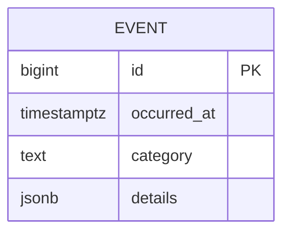

# Operations lab model

```mermaid
erDiagram
    EVENT {
        bigint id PK
        timestamptz occurred_at
        text category
        jsonb details
    }
```

This independent fixture has no foreign keys. Add an architecture diagram for backup storage, restore target, roles, and monitoring as those components are implemented.
